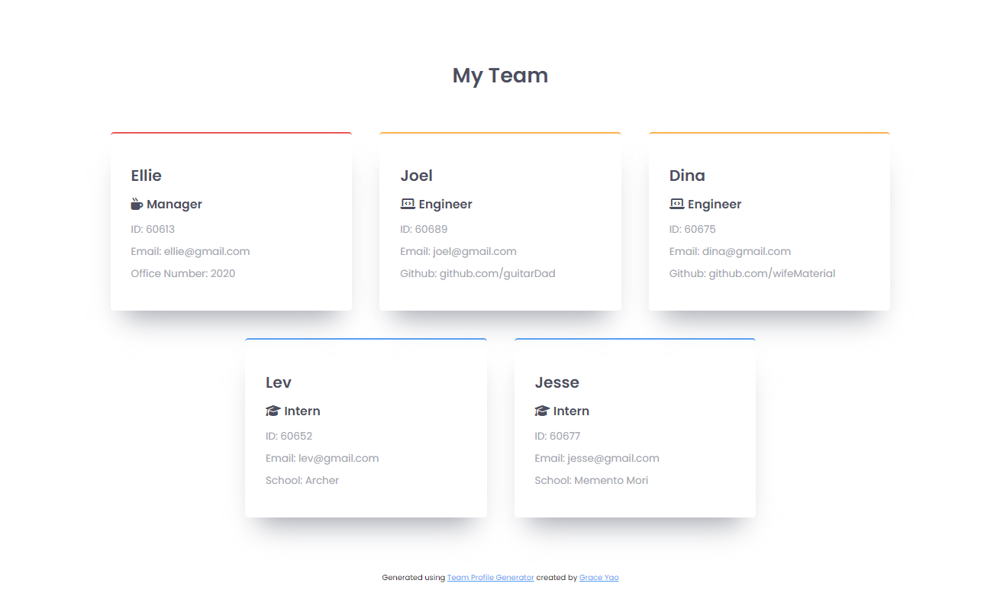

# Team Profile Generator
The Team Profile Generator is a powerful Node.js command-line application that simplifies team management. Effortlessly input employee information and witness the magic as it generates an impressive HTML webpage showcasing detailed summaries for each team member. Stay organized and efficient with this intuitive tool designed for software engineering teams.

## Description
A simple Node.js command-line application that generates an HTML webpage from information entered about employees on a software engineering team. The HTML webpage displays the roster of employees with summaries for each person in a clean, readable interface. 

## Table of Contents 
  - [Demo](#demo)
  - [Installation](#installation)
  - [Usage](#usage)
  - [License](#license)
  - [Credits](#credits)

## Demo

## Installation
1. Clone the repository to your local machine using `git clone` 
2. Open the terminal/command line and navigate to the root folder
3. Run `npm install` to install the following npm package dependencies specefied in `package.json`:
* `inquirer`

## Usage
1. Run `node index.js` in the terminal
2. Answer the prompts that appear about the team manager
3. After questions about the team manager are answered, you will be shown a menu where you can choose to enter an engineer, an intern, or to finalize your team
4. Enter information for as many engineers and interns as you have on your team, and click finalize when you are done adding all team members
5. An index.html file will be created containing your roster
6. Open the index.html file in your browser to display the roster

## License
Please refer to the license in the repo

## Credits
* Built by Grace Yao
* Card layout inspired by 

## Collaborations
Collaborations and feedback are welcome! If you have any suggestions, enhancements, or bug reports, please feel free to open an issue or submit a pull request. Additionally, if you have any questions or need assistance with the application, don't hesitate to reach out. 

